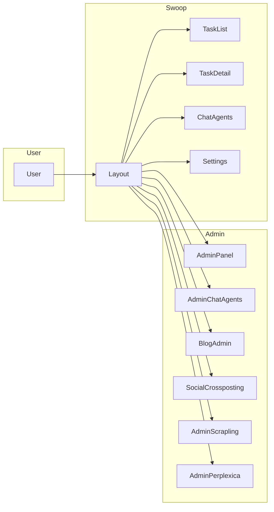

# Swoop.autoro.tech — Обзор структуры и стека

## 1. Назначение

**swoop.autoro.tech** — единая админка и дашборд для сервисов Autoro:

- Marketing Audit (анализ рекламных данных)
- Chat Agent (управление чат-ботами)
- Blog (управление постами блога)
- Social Crossposting (кросс-постинг в соцсети)
- Web Scraping (Scrapling)
- Perplexica (AI Search)

---

## 2. Стек

| Технология | Версия |
|------------|--------|
| Vite | 5 |
| React | 18 |
| React Router DOM | 6 |
| TypeScript | 5 |
| Tailwind CSS | 3 |
| Supabase JS | 2.39 |
| lucide-react | 0.309 |
| react-markdown, remark-gfm | — |

**package.json**: `autoro-dashboard`

---

## 3. Структура проекта

```
website/
├── src/
│   ├── App.tsx                 # Роутинг
│   ├── main.tsx
│   ├── index.css
│   ├── components/
│   │   ├── Layout.tsx          # Сайдбар, навигация
│   │   ├── Login.tsx
│   │   ├── TaskList.tsx        # Список задач Marketing Audit
│   │   ├── TaskDetail.tsx
│   │   ├── FileUpload.tsx
│   │   ├── FileList.tsx
│   │   ├── AdminPanel.tsx      # Админка Marketing Audit
│   │   ├── AdminChatAgents.tsx # Админка Chat Agent
│   │   ├── ChatAgents.tsx      # Клиентский Chat Agent
│   │   ├── BlogAdmin.tsx       # Админка блога
│   │   ├── BlogPostEditor.tsx
│   │   ├── BlogPostGenerator.tsx
│   │   ├── BlogSettings.tsx
│   │   ├── SocialCrossposting.tsx
│   │   ├── AdminScrapling.tsx  # Web Scraping (Scrapling)
│   │   └── AdminPerplexica.tsx # Perplexica iframe
│   └── lib/
│       ├── supabase.ts         # Supabase client
│       ├── format.ts
│       └── antiDebug.ts
├── public/
├── package.json
├── vite.config.ts
├── nginx.conf                  # Конфиг для production
├── Dockerfile
├── docker-compose.yml
├── docker-compose.override.yml
├── admin_scrapling.sql
└── scrapling-worker/
```

---

## 4. Маршруты (App.tsx)

| Путь | Компонент | Доступ |
|------|-----------|--------|
| `/login` | Login | Публичный |
| `/` | TaskList | Пользователь |
| `/task/:id` | TaskDetail | Пользователь |
| `/chat-agent` | ChatAgents | Пользователь |
| `/settings` | Placeholder | Пользователь |
| `/admin` | Redirect → `/admin/marketing-audit` | Admin |
| `/admin/marketing-audit` | AdminPanel | Admin |
| `/admin/chat-agent` | AdminChatAgents | Admin |
| `/admin/blog` | BlogAdmin | Admin |
| `/admin/social-crossposting` | SocialCrossposting | Admin |
| `/admin/web-scraping` | AdminScrapling | Admin |
| `/admin/perplexica` | AdminPerplexica | Admin |

---

## 5. Компоненты и функции

| Компонент | Функция |
|-----------|---------|
| **Layout** | Сайдбар, меню (Services / Administration), проверка admin, logout |
| **AdminPanel** | Задачи Marketing Audit, пользователи, system prompts, документы |
| **AdminChatAgents** | Управление Chat Agent: клиенты, боты, домены, base KB |
| **BlogAdmin** | CRUD постов блога, настройки, генератор постов |
| **SocialCrossposting** | Кросс-постинг в соцсети |
| **AdminScrapling** | Форма скрапинга (URL, режим, селектор), таблица задач |
| **AdminPerplexica** | iframe на perplexica.autoro.tech |

---

## 6. Supabase

### 6.1 Конфигурация

- **URL**: `https://swoop.autoro.tech/supabase`
- **Ключ**: `VITE_SUPABASE_ANON_KEY` (env)

Файл: [src/lib/supabase.ts](src/lib/supabase.ts)

### 6.2 Таблицы

| Таблица | Назначение |
|---------|------------|
| `profiles` | Пользователи, role, is_blocked |
| `tasks` | Задачи Marketing Audit (status, rag_status, analysis_status, llm_provider) |
| `documents` | Файлы задач (task_id, file_path, virus_status) |
| `system_prompts` | Системные промпты по data_source |
| `marketing_audit_jobs` | Очередь обработки (cleaning, analysis) |
| `chat_agents` | Чат-боты |
| `chat_agent_domains` | Домены ботов |
| `chat_agent_base_kb` | База знаний для ботов |
| `scrapling_jobs` | Очередь задач Scrapling |

### 6.3 Storage

- **bucket**: `user_uploads`
- Пути: `{user_id}/{task_id}/...`, `scrapling-results/{job_id}.md`

---

## 7. Docker и деплой

### 7.1 Сервисы (docker-compose.yml)

| Сервис | Контейнер | Домен |
|--------|-----------|-------|
| frontend | autoro-frontend | swoop.autoro.tech |
| scrapling-worker | autoro-scrapling-worker | — |

### 7.2 Сети

- `proxy` (external)
- `supabase_net` (vladx_anythingllm-n8n-bridge)

### 7.3 nginx.conf (внутри контейнера frontend)

- Раздача статики из `/usr/share/nginx/html`
- `/supabase/` → proxy на `supabase-kong:8000`
- `/api/blog/` → proxy на `autoro-blog-nextjs:3000`
- `/_next/`, `/(en|ru)/blog` → proxy на `autoro-blog-nextjs:3000`

### 7.4 Dockerfile

- Build: Node 18, `npm run build`
- Production: nginx:alpine, статика из `dist/`

---

## 8. Переменные окружения

| Переменная | Назначение |
|------------|------------|
| `VITE_SUPABASE_ANON_KEY` | Supabase anon key |
| `VITE_PERPLEXICA_URL` | URL Perplexica (по умолчанию `https://perplexica.autoro.tech`) |

---

## 9. Связанные сервисы

| Сервис | Путь | Назначение |
|--------|------|------------|
| marketing-audit-processor | `website/marketing-audit-processor/` | Python-воркер: очистка, анализ, Gemini |
| chat-indexer | `website/chat-indexer/` | Индексация для Chat Agent |
| chat-gateway | `website/chat-gateway/` | Шлюз чата |
| scrapling-worker | `website/scrapling-worker/` | Python-воркер Scrapling |

---

## 10. Схема маршрутов


