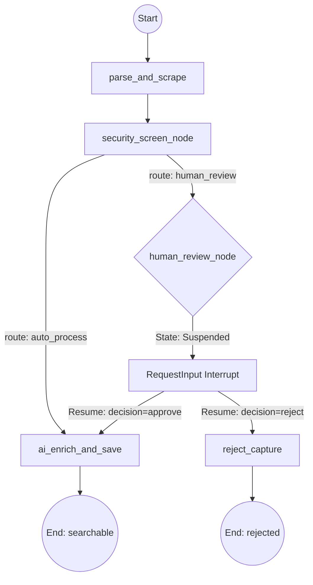

# ADK 2.0 Capture Workflow with Human-in-the-Loop (HITL)

This document describes the architecture, states, and execution flows of the Keept content ingestion and screening graph built on Google ADK 2.0.

## Workflow Graph Architecture

The ingestion logic is modeled as a stateful `Workflow` in [agent_workflow.py](file:///Users/vlad_x/Desktop/n8n/google%20intensive/keep-it-for-me/app/agent_workflow.py). It ensures security screening (PII redaction, prompt injection defense) occurs before enrichment and database storage, utilizing an interactive step to pause and request human review if needed.



### Workflow Nodes Description

1. **`parse_and_scrape`**:
   - Parses input JSON payload containing `url`, `text`, `workspace_id`, etc.
   - Fetches content from raw url using Jina Reader API as a fallback if the text body is empty.
   - Normalizes the url and generates a content hash.

2. **`security_screen_node`**:
   - Checks the scraped text for PII (SSN, credit cards, emails, phone numbers) and redacts them.
   - Evaluates text for prompt injection keywords (e.g., "bypass", "auto-approve", "override").
   - Routes to `human_review` if any PII categories were redacted or injection was detected; otherwise routes to `auto_process`.

3. **`human_review_node`**:
   - Suspends execution on first entry, yielding a `RequestInput(interrupt_id="decision", message="...")` event.
   - Upon receiving resume input (`decision="approve"` or `decision="reject"`), routes execution to `ai_enrich_and_save` or `reject_capture` respectively.

4. **`ai_enrich_and_save`**:
   - Invokes Classifier and Enrichment agents to extract category, tags, and summary.
   - Generates text embeddings via `text-embedding-004`.
   - Saves the final entry with status `'searchable'` to PostgreSQL.
   - Syncs content to the workspace Obsidian vault as a Markdown note.

5. **`reject_capture`**:
   - Saves the entry to the DB with status `'rejected'` for audit logging without performing LLM enrichment, embeddings generation, or Obsidian syncing.

---

## State Diagram & Data Contracts

### 1. Ingestion Request Contract (Payload)
```json
{
  "workspace_id": 1,
  "source": "web",
  "url": "https://example.com/topic",
  "text": "User text here...",
  "original_sender": "user_123",
  "title": "Topic Title"
}
```

### 2. Auto-Process Output (Route: auto_process)
```json
{
  "id": 42,
  "status": "searchable",
  "title": "Descriptive Title",
  "category": "dev-tools",
  "tags": ["python", "fastapi"],
  "security_route": "auto_process",
  "security_alert": false,
  "redacted_categories": []
}
```

### 3. Suspended/Pending Output (Route: human_review)
```json
{
  "id": 43,
  "status": "pending",
  "session_id": "8a32d184-722a-4638-a15d-f1bbd067b14d",
  "moderationId": "9fa021cb-42a8-48be-88e9-4e782aef4f01",
  "security_route": "human_review",
  "security_alert": true,
  "redacted_categories": ["SSN"],
  "title": "Sensitive Document"
}
```

---

## Operations & Local Playground Integration

### Running the local Playground
To start the ADK 2.0 Developer UI:
```bash
cd "/Users/vlad_x/Desktop/n8n/google intensive/keep-it-for-me"
make playground
```
This runs the playground local server which loads the workflow graph configuration. You can open `http://localhost:8081/dev-ui` in the browser to interactively trace and debug inputs, trigger suspensions, and provide human resume decisions.

### Testing Workflow Executions
You can run automated test cases (both unit and integration tests) using:
```bash
# Run security unit tests
uv run pytest tests/unit/test_security.py -v

# Run full integration pipeline tests including capture, search and uploads
uv run pytest tests/integration/test_rag_pipeline.py -v
```
