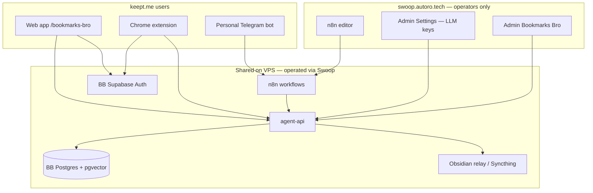
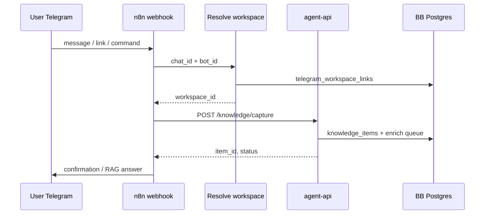

# Antigravity — Swoop Tools × Keep It For Me (`keept.me`)

> **Audience:** Google Antigravity  
> **Updated:** 2026-06-16  
> **Prerequisite:** [ANTIGRAVITY-KEEPT-BRIEF.md](./ANTIGRAVITY-KEEPT-BRIEF.md), AuthRAG [ANTIGRAVITY-INFRA-BRIEF.md](https://github.com/autorotech-tech/AuthRAG/blob/bookmarks-bro/docs/ANTIGRAVITY-INFRA-BRIEF.md)  
> **Product goal:** multi-user SaaS with self-service registration + **personal Telegram assistant** per user

---

## 1. Two products on one platform

| | **Swoop** (`swoop.autoro.tech`) | **Keep It For Me** (`keept.me`) |
|---|----------------------------------|----------------------------------|
| **Who** | Autoro operators, internal team | End users (B2C / prosumer) |
| **Auth** | Main Supabase (Swoop) | **BB Supabase** (`/bb-supabase`) — isolated |
| **UI** | Marketing audit, blog admin, scrapling, settings | `/bookmarks-bro` app + Chrome extension |
| **Role** | **Control plane:** LLM keys, ops, n8n, monitoring | **Data plane:** personal KB, RAG, Telegram capture |

**Rule:** Keept users **never** log into Swoop. Swoop admin configures shared infrastructure; Keept users only see Keept UI.



---

## 2. Swoop tools to wire for Keept

### 2.1 agent-api (required)

Single FastAPI service; Keept routes use `BOOKMARKS_*` env to isolate DB/Auth.

| Tool / surface | Swoop path | Keept usage |
|----------------|------------|-------------|
| Bookmarks API | `agent-api/main.py` | sync, enrich, search, capture, bootstrap |
| LLM routing | `service_settings.agent_llm_routing` | enrich, ideas, Telegram answers |
| API keys pool | Swoop **Admin → Settings → Provider API Keys** | OpenRouter/Gemini/OpenAI for enrich |
| Ops panel | `/admin/bookmarks-bro` | operator debug per `workspaceId` |
| Health | `GET /api/v1/health` | smoke |

**Connect (VPS):**

```bash
# agent-api with BB stack override
docker compose \
  -f docker-compose.yml \
  -f ops/bookmarks-bro-supabase/docker-compose.agent-api.bookmarks.override.yml \
  up -d --build agent-api
```

Env template: `ops/bookmarks-bro-supabase/.env.agent-api.bookmarks.example`

### 2.2 Swoop Admin Settings (operator)

Path: `swoop.autoro.tech` → **Admin → Settings** (`AdminSettings.tsx`)

| Setting block | Keept dependency |
|---------------|------------------|
| **OpenRouter** keys + default/fallback model | `ai_enrich_*`, `ai-recommend`, Telegram LLM |
| **Bookmarks Bro — LLM routing (JSON)** | step chains per task (`enrich`, `ideas`, `telegram`) |
| **Provider API Keys panel** | Gemini/OpenAI/Groq rotation |
| `agent_api_key` | extension bootstrap + admin ops only |

Models: always `<provider>/<model>` (e.g. `anthropic/claude-3.7-sonnet`).

### 2.3 n8n (Telegram + capture)

| Asset | Path | Role |
|-------|------|------|
| Personal assistant workflow | `n8n/workflows/telegram_personal_assistant_memory.json` | inbound Telegram → memory / Hermes / capture |
| Knowledge tool | `tmp/hermes-tools/autoro_knowledge_tool.py` | `POST /api/v1/knowledge/capture` |
| Webhook secret | `TELEGRAM_WEBHOOK_SECRET` | validate inbound updates |

**Keept-specific change (Phase 3):** replace hardcoded `KNOWLEDGE_WORKSPACE_ID` / `TELEGRAM_DEFAULT_WORKSPACE_ID` with **resolve workspace from `telegram_workspace_links`**.

### 2.4 BB Supabase (end-user auth)

| Component | URL (staging) |
|-----------|---------------|
| Auth API | `https://swoop.autoro.tech/bb-supabase` |
| Ops | `ops/bookmarks-bro-supabase/` |

Not Swoop's main Supabase. See `AUTH-SETUP.md` (Phase 1).

### 2.5 Optional Swoop services

| Service | Use for Keept |
|---------|---------------|
| `scrapling-worker` | heavy URL fetch if enrich needs it |
| `obsidian-relay` | per-workspace note sync |
| `chat-gateway` / Hermes | Telegram `/ask`, `/research` commands in n8n |
| Perplexica | **not** in Keept MVP — web research via agent-api `/api/v1/web/search` if needed |

---

## 3. Multi-user product architecture

### 3.1 Entities

```text
auth.users (BB Supabase)
    └── workspaces (owner_id, name, plan)
            └── workspace_members (user_id, role)   # Phase 2
            └── bookmarks_bro_bookmarks
            └── bookmark_page_content (tags, category, embedding)
            └── knowledge_items / knowledge_vectors
            └── workspace_ui_state (ideas, reminders snapshot)
            └── telegram_workspace_links            # Phase 3
            └── user_telegram_bots (optional)       # Phase 3b personal bot token
```

### 3.2 Registration & onboarding (target UX)

| Step | Action | API / system |
|------|--------|--------------|
| 1 | Sign up (email or Google) | BB Supabase Auth |
| 2 | Auto-create workspace | `POST /api/v1/bookmarks/workspaces/ensure` with user JWT |
| 3 | Land in Keept app | `/bookmarks-bro` — EN UI |
| 4 | Install extension | OAuth + bootstrap token |
| 5 | Connect Telegram | Settings → link flow (below) |
| 6 | First capture | extension save / Telegram message / paste URL |

### 3.3 Tenant isolation (Phase 2 — after Phase 1 blockers)

| Layer | Mechanism |
|-------|-----------|
| Auth | JWT from BB Supabase; `owner_id` on `workspaces` |
| API | Middleware: `workspaceId` ∈ allowed set for JWT user |
| DB | RLS on BB Postgres (`migrate_bookmarks_bro_mvp.sql`) |
| Obsidian | `Autoro KB/ws-{workspace_id}` |
| Extension | `resolveWorkspaceId()` from ensure — no hardcoded `1` |

Reference: `docs/bookmarks-bro/ADMIN-MULTIUSER.md`

### 3.4 Roles (target)

| Role | Scope |
|------|--------|
| `owner` | full workspace, billing, Telegram link |
| `admin` | invite members, manage bots |
| `member` | capture + search |
| `readonly` | search + export only |
| Autoro ops | Swoop admin + `X-API-Key` — all workspaces |

---

## 4. Personal Telegram assistant

### 4.1 Product intent

Each Keept user gets a **personal assistant** that:

- saves messages/links to **their** workspace KB;
- answers from **their** vectors (RAG);
- confirms capture status in chat;
- supports commands: `/help`, `/search`, `/ask` (optional Hermes).

### 4.2 Two implementation tiers

#### Tier A — MVP (Phase 3.0): platform bot + account linking

One **Keept Bot** (`@KeeptMeBot` or similar), multi-tenant via linking:

```text
User in Keept Settings → "Connect Telegram" → shows link code (6 chars, 10 min TTL)
User sends to bot: /start KEEPT-ABC123
→ telegram_workspace_links(telegram_user_id, chat_id, workspace_id, user_id)
```

| Table | Columns |
|-------|---------|
| `telegram_link_codes` | `code`, `user_id`, `workspace_id`, `expires_at` |
| `telegram_workspace_links` | `telegram_user_id`, `chat_id`, `workspace_id`, `user_id`, `linked_at` |

n8n node **Resolve Workspace:** lookup by `chat_id` / `telegram_user_id` — fail closed if not linked.

#### Tier B — Personal bot (Phase 3.1): user-owned BotFather token

Power users paste **their own** bot token in Keept Settings:

| Table | Columns |
|-------|---------|
| `user_telegram_bots` | `user_id`, `workspace_id`, `bot_token_encrypted`, `bot_username`, `webhook_secret`, `status` |

On save:

1. Validate token (`getMe`).
2. Register webhook → `https://n8n…/webhook/keept-telegram/{webhook_secret}`.
3. Store encrypted token (KMS or `pgcrypto` + server secret).

**Security:** never log tokens; encrypt at rest; one bot ↔ one workspace.

### 4.3 n8n pipeline (both tiers)



Workflow base: clone `telegram_personal_assistant_memory.json` → `keept_telegram_assistant.json`

Replace:

- `TELEGRAM_DEFAULT_WORKSPACE_ID` → **Resolve workspace** node
- `swoop_user_email` hardcode → `user_id` from link table
- RU strings → EN for Keept-branded replies

### 4.4 Telegram env (operator / n8n)

| Variable | Scope |
|----------|--------|
| `TELEGRAM_BOT_TOKEN` | Tier A: platform bot |
| `TELEGRAM_WEBHOOK_SECRET` | webhook validation |
| `TELEGRAM_CHAT_WORKSPACE_MAP` | **legacy** — migrate to DB table |
| `AGENT_API_URL` | `https://swoop.autoro.tech` or internal docker |
| `BOOKMARKS_AGENT_API_KEY` | optional; prefer user-scoped JWT for capture |

---

## 5. Phase map (Keept + Swoop)

| Phase | Focus | Swoop touchpoints |
|-------|--------|-------------------|
| **1** | Auth, taxonomy, EN UI | BB Supabase, AUTH-SETUP, agent-api normalize |
| **1.5** | Re-enrich legacy tags | AdminBookmarksBro enrich run |
| **2** | Multi-user isolation | JWT middleware, `workspace_members`, RLS |
| **3.0** | Telegram Tier A | n8n clone, `telegram_workspace_links`, Keept Settings UI |
| **3.1** | Telegram Tier B | `user_telegram_bots`, encrypted tokens |
| **4** | RAG quality | Swoop LLM routing tuning |
| **5** | `keept.me` prod domain | nginx, BB auth URLs, marketing site |

**Do not skip Phase 2 before opening public multi-user registration.**

---

## 6. Antigravity setup checklist

### 6.1 Repos & skills

```bash
git clone https://github.com/autorotech-tech/AuthRAG.git
cd AuthRAG && git checkout bookmarks-bro

# In website monorepo (if available):
bash scripts/link-antigravity-skills.sh
```

Read order:

1. `docs/ANTIGRAVITY-KEEPT-BRIEF.md`
2. `docs/ANTIGRAVITY-SWOOP-KEEPT.md` (this file)
3. `docs/ANTIGRAVITY-INFRA-BRIEF.md`
4. `docs/ANTIGRAVITY-SWOOP-API.md` (agent-api reference)
5. `ROADMAP.md`

### 6.2 Staging access (operator)

| Resource | Staging URL / path |
|----------|-------------------|
| Swoop admin | `https://swoop.autoro.tech/admin/settings` |
| Keept app | `https://swoop.autoro.tech/bookmarks-bro` |
| BB Supabase dashboard | `https://swoop.autoro.tech/bb-supabase` (Kong route) |
| n8n | VPS internal / operator URL |
| VPS | `46.250.228.229` user `vladx` |

Secrets: env files on VPS only — never commit.

### 6.3 Smoke commands

```bash
python3 -m py_compile agent-api/main.py
node scripts/bookmarks-bro-smoke.mjs    # website repo, needs AGENT_API_URL
node scripts/bookmarks-bro-api-test.mjs
```

### 6.4 Implementation order for multi-user + Telegram

1. **Phase 1** complete (auth, EN, taxonomy).
2. **Phase 2:** `workspace_members`, JWT guard, ensure workspace on signup.
3. **Keept Settings page:** profile, workspace name, **Connect Telegram** (link code).
4. **SQL:** `telegram_link_codes`, `telegram_workspace_links`.
5. **agent-api:** `POST /api/v1/keept/telegram/link-code`, `POST /api/v1/keept/telegram/complete-link` (bot callback or polling).
6. **n8n:** clone workflow, add Resolve workspace node.
7. **Tier B:** `user_telegram_bots` + encrypt + webhook register.

---

## 7. API additions (spec for Phase 2–3)

| Method | Path | Purpose |
|--------|------|---------|
| `GET` | `/api/v1/bookmarks/workspaces` | List workspaces for JWT user |
| `POST` | `/api/v1/bookmarks/workspaces/ensure` | Create default workspace on signup |
| `POST` | `/api/v1/keept/telegram/link-code` | Generate 6-char code (auth required) |
| `POST` | `/api/v1/keept/telegram/complete-link` | Bot service: code + telegram_user_id → link row |
| `GET` | `/api/v1/keept/telegram/status` | Linked? bot username? |
| `POST` | `/api/v1/keept/telegram/bot-token` | Tier B: save encrypted token |
| `DELETE` | `/api/v1/keept/telegram/unlink` | Remove links |

Existing capture endpoint (unchanged):

- `POST /api/v1/knowledge/capture` — must receive correct `workspaceId` from resolver.

---

## 8. Copy-paste kickoff (multi-user + Telegram)

```
Project: BrowserBro / Keep It For Me (keept.me).
Read: ANTIGRAVITY-KEEPT-BRIEF.md → ANTIGRAVITY-SWOOP-KEEPT.md → ANTIGRAVITY-INFRA-BRIEF.md → ROADMAP.md.

Architecture:
- End users on BB Supabase (not Swoop login).
- Swoop = operator control plane (LLM keys, n8n, AdminBookmarksBro).
- Multi-tenant via workspace_id + JWT (Phase 2 before public signup).
- Personal Telegram: Tier A link-code on platform bot (Phase 3.0), Tier B user BotFather token (Phase 3.1).

Do not commit secrets. Implement in website monorepo; sync AuthRAG at Phase 1 end.
Start Phase 1 if not done; design SQL + API stubs for telegram_workspace_links in Phase 2 branch only.
```
