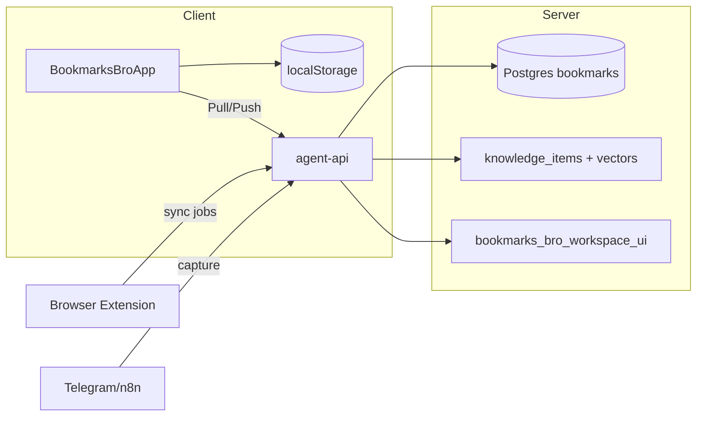

# Bookmarks Bro — математическая модель проекта

Версия документа: **0.1.1-testing** (согласована с `BOOKMARKS_BRO_BUILD`).  
Связь с продуктом: [[Unified Knowledge Base Plan]], эндпоинты `agent-api`.

---

## 1. Множества и сущности

| Символ | Множество | Описание |
|--------|-----------|----------|
| \(W\) | \(\mathbb{Z}_{>0}\) | Идентификаторы workspace (tenant) |
| \(U\) | \(W \times \mathcal{P}(\text{User})\) | Пользователи в рамках workspace (через auth) |
| \(B_w\) | Конечные подмножества закладок | Закладки workspace \(w\) |
| \(K_w\) | Конечные подмножества | Записи `knowledge_items` (ingestion pipeline) |
| \(V_w\) | \(\mathbb{R}^{1536}\) (частично) | Векторы `knowledge_vectors` для \(k \in K_w\) |
| \(I_w\) | JSON-массив идей | UI-снимок `ideas` в `bookmarks_bro_workspace_ui` |
| \(R_w\) | JSON-массив | UI-снимок `reminders` |
| \(C_w\) | JSON-массив | UI-снимок `knowledge_cards` (карточки KB в приложении) |
| \(T\) | События телеметрии | Локальная очередь (до 200 событий) |

Для фиксированного \(w \in W\) полное **серверное UI-состояние**:

\[
S_w = (I_w, R_w, C_w, \tau_w), \quad \tau_w \in \mathbb{T}
\]

где \(\tau_w\) — `updated_at` (время последнего `PUT`).

**Локальное состояние клиента** (браузер / Tauri):

\[
L_w = (I_w^{loc}, R_w^{loc}, C_w^{loc}, \mathcal{K}^{loc})
\]

\(\mathcal{K}^{loc}\) — кэш workspaceId, токенов, телеметрии.

---

## 2. Конвейер знаний (Knowledge Ingestion)

Каждый элемент \(k \in K_w\) имеет статус \(\sigma(k) \in \Sigma\):

\[
\Sigma = \{\texttt{captured}, \texttt{to\_process}, \texttt{enriched}, \texttt{indexed}, \texttt{searchable}\}
\]

**Детерминированный автомат** (упрощение prod-пайплайна):

\[
\delta: \Sigma \times \mathcal{E} \to \Sigma
\]

| Событие \(\mathcal{E}\) | Переход |
|-------------------------|---------|
| `ingest` | → `captured` / `to_process` |
| `enrich_ok` | → `enriched` |
| `embed_ok` | → `indexed` |
| `index_ok` | → `searchable` |
| `fail` | остаётся в текущем или `to_process` |

**Идемпотентность захвата** по хешу контента:

\[
h(k) = \text{SHA256}(\text{source} \,\|\, \text{canonical\_url} \,\|\, \text{text})
\]

Уникальность: \((w, h(k))\) уникален в `knowledge_items`.

**Наблюдаемость ingest** (метрики на интервале \(\Delta t\)):

\[
\lambda_{\text{ingest}}(w) = \frac{|\{k \in K_w : t_{\text{created}}(k) \in \Delta t\}|}{|\Delta t|}
\]

---

## 3. Поиск

Запрос \(q\), лимит \(L\). Режим **semantic** (если есть embedding \(e(q)\)):

\[
\text{rank}_{\text{sem}}(k) = \| e(q) - v(k) \|_2, \quad v(k) \in V_w
\]

Результат:

\[
\text{Search}_{\text{sem}}(w, q, L) = \text{top-}L_{k \in K_w} \text{ по возрастанию } \text{rank}_{\text{sem}}(k)
\]

Режим **text** (fallback):

\[
\text{match}(k, q) \Leftrightarrow q \subseteq^{\text{substr}} (\text{title}(k) \cup \text{url}(k) \cup \text{content}(k))
\]

**Гибрид в AI-recommend** (параметр `searchMode: hybrid`):

\[
\text{Retrieve}(w, q) = \alpha \cdot \text{Search}_{\text{sem}} + (1-\alpha) \cdot \text{Search}_{\text{text}}, \quad \alpha \in [0,1]
\]

(в коде \(\alpha\) неявно задаётся эвристикой API).

---

## 4. Синхронизация UI (клиент ↔ agent-api)

### 4.1 Операторы

- **Pull**: \(S_w \leftarrow \text{GET}(\texttt{/workspace-ui-state})\)
- **Push**: \(S_w \leftarrow \text{PUT}(I_w^{loc}, R_w^{loc}, C_w^{loc})\) с debounce \(\Delta_d = 700\,\text{ms}\)

### 4.2 Hydrate при старте

Пусть \(S_w^{srv}\) — ответ сервера, \(L_w^{loc}\) — localStorage.

\[
\text{merge}(S_w^{srv}, L_w^{loc}) =
\begin{cases}
L_w^{loc} & \text{если } S_w^{srv} = \varnothing \text{ и } L_w^{loc} \neq \varnothing \quad \text{(миграция вверх)} \\
S_w^{srv} & \text{иначе, если сервер доступен}
\end{cases}
\]

После merge включается флаг \(\pi = \texttt{persist\_enabled}\); при \(\pi=1\) любое изменение \(L_w\) запускает отложенный Push.

### 4.3 Инварианты тестовой версии

1. \(\forall w\): после успешного Push, \(\|I_w^{srv}\|_0 \leq 500\) (аналогично для \(R_w, C_w\)).
2. Пока \(\pi=0\), Push не выполняется (защита от затирания пустым снапшотом).
3. Auth: запрос допустим \(\Leftrightarrow\) \(\text{verify\_bookmarks\_access} = \text{ok}\).

---

## 5. Выгрузка базы знаний (Export)

\[
\text{Export}(w, q, L, \text{semantic}) \rightarrow (\mathcal{M}, \mathcal{J}, \eta)
\]

- \(\mathcal{M}\) — markdown-отчёт  
- \(\mathcal{J}\) — JSON items  
- \(\eta\) — число векторизованных записей в выборке  

Ограничение: \(L \leq 500\).

---

## 6. Токены (учёт LLM)

Для задачи \(t\) на интервале сессии:

\[
\text{Tokens}(w, t) = \sum_{i} (\text{prompt}_i + \text{completion}_i)
\]

Агрегация на сервере в `bookmarks_token_usage` по `task_name`.

---

## 7. Функция готовности к тестированию

Вектор критериев \(\mathbf{c} \in \{0,1\}^n\). **Тестовая версия готова**, если:

\[
\text{Ready}_{\text{test}} = \bigwedge_{i=1}^{n} c_i = 1
\]

| \(i\) | Критерий \(c_i=1\) |
|------|---------------------|
| 1 | `npm run build` успешен |
| 2 | `npm run bookmarks-bro:smoke` успешен |
| 3 | `npm run bookmarks-bro:api-test` успешен (agent-api доступен) |
| 4 | Hydrate + Push UI state на одном \(w\) |
| 5 | `POST /knowledge/export` возвращает markdown |
| 6 | В UI отображается build id и статус sync |

**Целевая метрика приёмки** (ручной тест, 2 устройства / 2 профиля):

\[
\text{Consistency} = \mathbb{1}\left[ \text{Pull}(w) \text{ после Push на A} = \text{состояние на B} \right] \geq 0.95
\]

---

## 8. Архитектурная схема (композиция)

---

## 9. Roadmap → прод (вне тестовой модели)

- Замена snapshot UI на построчные CRUD для \(I_w, R_w, C_w\) с версионированием.
- CRDT / OT для offline-first вместо last-write-wins.
- Формализация \(\alpha\) в hybrid search и SLA \(\lambda_{\text{ingest}}\).
