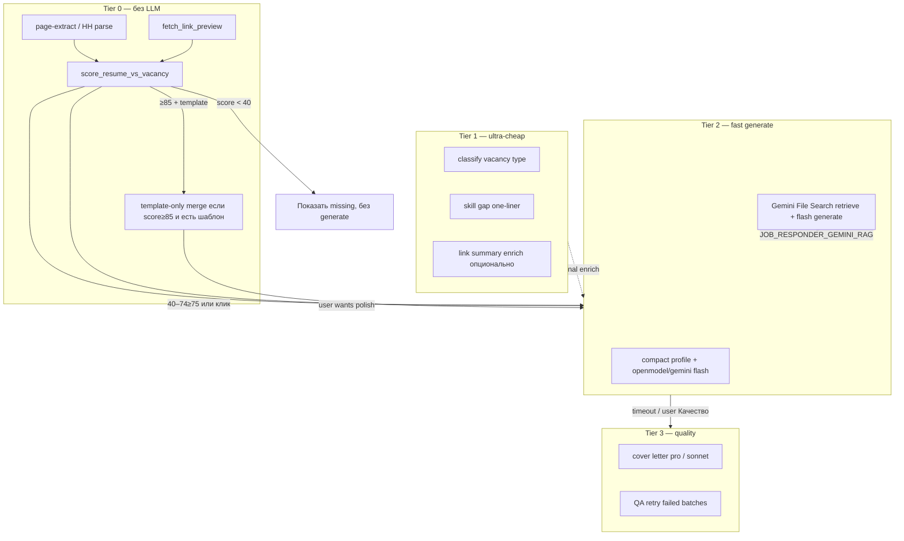

# Job Responder: маршрутизация моделей и экономия токенов

Дизайн token-efficient multi-model схемы для Job Responder (JR). **Только архитектура** — реализация отдельными фазами; Gemini File Search описан в [gemini-rag.md](./gemini-rag.md) и не дублируется здесь.

**Ограничения:** OpenRouter не primary; ключи и дефолтные модели — Swoop Admin → Settings (`openmodel_keys`, `gemini_keys`, `groq_keys`, `glm_keys`, опционально `mimo_keys`, `kimi_keys`).

---

## 1. Текущее состояние (baseline)

| Путь | LLM? | Провайдер / модель | Input (оценка) |
|------|------|-------------------|----------------|
| Парсинг вакансии (extension) | Нет | `page-extract.js`, DOM/heuristics | 0 |
| Link preview при ingest | Нет | `fetch_link_preview` — title + meta/280 симв. | 0 |
| Relevance score | **Нет** | `score_resume_vs_vacancy` — детерминированный 0–100 | 0 |
| Generate cover letter | Да | openmodel → `gemini-3.5-flash` → GLM fast | ~1.8–2.2k tokens |
| Generate Q&A (Forms) | Да | та же цепочка | ~2.5–6k+ (зависит от числа вопросов) |
| Compact profile | N/A | merge + cap 2800 симв. (retry 1600) | в prompt |
| Embeddings (RAG ingest) | Да | GLM / Groq / Gemini pool (не generate) | отдельный бюджет |

Константы в `agent-api/job_responder.py`:

- `COMPACT_PROFILE_CHARS=2800`, `GENERATE_VACANCY_CHARS=1600`, `COVER_TEMPLATE_CHARS=1200`
- `max_tokens`: 550 (cover; soft-retry 650 if truncated), 700 (qa)
- `GENERATE_BUDGET_SEC=34`, `LLM_ATTEMPT_TIMEOUT_SEC=11`
- Явный cascade: **openmodel → gemini (`JR_GEMINI_MODEL`) → glm**; OpenRouter пропущен

Swoop `agent_llm_routing` уже поддерживает `tiers`, `tier_models`, **`scenarios`** — JR пока не использует scenarios, только `route_provider_override` в generate.

---

## 2. Предлагаемая tier-схема (token economy)



### Tier 0 — No LLM

| Задача | Механизм | Когда | Fallback |
|--------|----------|-------|----------|
| Парсинг вакансии | Extension `page-extract.js` + structured fields | Всегда на странице | Ручной paste в panel |
| Link description | `fetch_link_preview` (title, og:description, strip HTML ≤280) | Ingest URL / links из CV | Пустой summary, URL как title |
| Relevance 0–100 | `score_resume_vs_vacancy` (tools/skills/role/format/exp) | Кнопка «Оценка» + внутри generate | — |
| Template-only отклик | Regex merge `{company}`, `{title}` в `coverTemplate` без LLM | `score ≥ 85` **и** шаблон ≥400 симв. **и** user opt-in «Без LLM» | Tier 2 по клику «Улучшить» |

**Input tokens:** 0  
**Latency:** &lt;100 ms (relevance), &lt;5 s (link preview)

### Tier 1 — Ultra-cheap / fast

Для задач, где нужен LLM, но не качество prose — **короткий output, temperature 0, max_tokens ≤150**.

| Задача | Provider | Model slug (Swoop) | ~Input | ~Output | Когда |
|--------|----------|-------------------|--------|---------|-------|
| Классификация вакансии (remote/onsite, seniority confirm) | groq | `llama-3.1-8b-instant` или catalog fast | 300–500 | 30–50 | Опционально, если structured fields пустые |
| Извлечение 5–8 skill keywords из description | openmodel | `deepseek-v4-flash` | 400–800 | 80–120 | Дополнение к Tier 0 relevance (не замена score) |
| Link summary enrich (если preview &lt;80 симв.) | groq / openmodel | groq 8b instant / `deepseek-v4-flash` | 600–900 | 60–100 | Флаг `JR_LINK_LLM_SUMMARY=1`, async после ingest |
| Q&A pre-filter («можно ответить из profile?») | openmodel | `deepseek-v4-flash` | 200/вопрос | 20 | Перед Tier 2 batch — skip LLM для factual yes/no |

**Fallback chain Tier 1:** `groq (8b instant)` → `openmodel/deepseek-v4-flash` → `kimi/moonshot-v1-8k` → skip (оставить Tier 0 результат).

**Не использовать:** GLM (медленный key pool), `gemini-2.5-pro`, OpenRouter.

### Tier 2 — RAG retrieve + fast generate (default UX)

Основной путь «Отклик» / «Ответы на вопросы».

| Подпуть | Context | Provider | Model | ~Input | ~Output |
|---------|---------|----------|-------|--------|---------|
| **2a Compact profile** (default) | vacancy ≤1600 + profile ≤2800 + template ≤1200 + system | openmodel → gemini → glm | `deepseek-v4-flash` → `gemini-3.5-flash` → `glm-4-flash` | 1.8–2.2k | 400–700 |
| **2b Gemini File Search** (opt-in) | vacancy + template; **без** full profile в prompt — retrieval в store | gemini only | `gemini-2.5-flash` или `gemini-3.5-flash` + `file_search` tool | 0.8–1.5k + retrieved chunks | 400–1200 |

Правила:

- **2a** — как сейчас, но routing через `agent_llm_routing.scenarios.job_responder_generate` вместо hardcoded tuple.
- **2b** — только при `JOB_RESPONDER_GEMINI_RAG=1` и непустом store; fallback на 2a без дублирования profile (см. §4).
- Q&A: **batch по 5 вопросов** на вызов Tier 2 (не один mega-prompt на 20+ вопросов).

**Fallback Tier 2:** openmodel → gemini flash → groq `llama-3.3-70b-versatile` (быстрее GLM) → glm last.

### Tier 3 — Quality generate

Только по явному действию или эскалации.

| Триггер | Задача | Provider | Model | ~Input | ~Output |
|---------|--------|----------|-------|--------|---------|
| Кнопка «Качество» в panel | Cover letter | gemini | `gemini-2.5-pro` или `gemini-3.5-pro` (catalog) | 2–2.5k | 700 |
| Retry после timeout Tier 2 | Cover / QA | openmodel | `claude-sonnet-4-6` | сжатый profile 1600 | 700–1200 |
| QA: ответы &lt;40 симв. или JSON fail | Перегенерация batch | gemini | `gemini-3.5-flash` → pro on 2nd fail | batch only | 400 |

**Fallback Tier 3:** gemini pro → openmodel sonnet → mimo `mimo-v2.5-pro` (если ключи есть) → **не** OpenRouter.

---

## 3. Fallback chain (сводная таблица)

| Tier | Порядок | Latency (p50 оценка) | Cost rel. | Качество |
|------|---------|----------------------|-----------|----------|
| 0 | — | &lt;0.1–5 s | 0 | N/A / deterministic |
| 1 | groq 8b → openmodel flash → kimi 8k | 0.3–1.5 s | ★ | classify/summary |
| 2a | openmodel flash → gemini 3.5 flash → groq 70b → glm flash | 3–12 s | ★★ | хорошо для HH |
| 2b | gemini flash + file_search | 5–15 s | ★★★ (retrieved tokens) | лучший grounding PDF |
| 3 | gemini pro → openmodel sonnet → mimo pro | 8–25 s | ★★★★ | polish / сложные формы |

---

## 4. Task-specific routing

| Task | Recommended tier | Model (primary) | Почему |
|------|------------------|-----------------|--------|
| Ingest link description | 0 (+ optional 1) | Tier 0 preview; Tier 1 `deepseek-v4-flash` если preview пуст | 1–2 предложения; не блокировать ingest |
| Relevance score | **0 only** | детерминированный scorer | Без random; объяснимые matched/missing |
| Cover letter (default) | 2a | `openmodel/deepseek-v4-flash` → `gemini-3.5-flash` | Баланс скорость/качество; уже на проде |
| Cover letter (quality) | 3 | `gemini-2.5-pro` | Длиннее думать; user-initiated |
| Form Q&A (≤5 вопросов) | 2a | один batch, `gemini-3.5-flash` | JSON стабильнее на flash |
| Form Q&A (6–20) | 2a batched | 2–4× batch × flash | Cap input; параллель max 2 batches |
| Form Q&A (retry bad JSON) | 3 | `gemini-3.5-flash` → pro | Только failed batch |
| Gemini File Search generate | 2b | `gemini-2.5-flash` + store | Built-in retrieval; без fat profile в prompt |
| Skill extract (ingest enrich) | 1 | `deepseek-v4-flash` | Дешёво; пишет в structured profile |
| Embeddings (RAG index) | infra | GLM `embedding-3` / Gemini embed | Не смешивать с generate budget |

### Маппинг на `agent_llm_routing.scenarios` (предложение)

```json
{
  "scenarios": {
    "job_responder_t1_classify": { "tier": "fast", "provider": "groq", "model": "llama-3.1-8b-instant" },
    "job_responder_t1_summarize": { "tier": "fast", "provider": "openmodel", "model": "deepseek-v4-flash" },
    "job_responder_generate": { "tier": "fast", "provider": "openmodel", "model": "deepseek-v4-flash" },
    "job_responder_generate_fallback": { "tier": "fast", "provider": "gemini", "model": "gemini-3.5-flash" },
    "job_responder_qa_batch": { "tier": "fast", "provider": "gemini", "model": "gemini-3.5-flash" },
    "job_responder_quality": { "tier": "reasoning", "provider": "gemini", "model": "gemini-2.5-pro" },
    "job_responder_gemini_rag": { "tier": "fast", "provider": "gemini", "model": "gemini-2.5-flash" }
  }
}
```

JR код: `openai_chat_completions_generic(..., scenario="job_responder_generate")` — потребует небольшого расширения agent-api (сейчас только `tier_override` + provider override).

---

## 5. Правила token budget

### Hard caps (на один HTTP `/generate`)

| Поле | Cap (chars) | Cap (~tokens) | Примечание |
|------|-------------|---------------|------------|
| `vacancy.description` | 1600 | ~400 | Уже есть |
| compact profile | 2800 (retry 1600) | ~700 (400) | Default path only |
| cover template | 1200 (retry 600) | ~300 | |
| system prompt | — | ~450 | Сократить duplicate rules в user |
| questions JSON (QA) | 120 chars × N, max 15 Q / request | ~750 | Batch если N&gt;5 |
| **Total input Tier 2a** | — | **≤3200 target, hard 4500** | Abort + compress before LLM |
| **max_tokens output** | cover 550 (retry 650), qa 700 | | |

### Unified profile vs File Search

| | Compact profile (Postgres RAG) | Gemini File Search |
|--|------------------------------|-------------------|
| **Когда primary** | Default; много мелких sources; latency-critical | PDF/portfolio grounding; цитаты; длинные CV |
| **Tokens** | Fixed ~700 в prompt | Profile **не** слать; pay retrieved chunks (~200–800) |
| **Dedupe** | `content_hash`, URL merge | `knowledge_item_id → gemini document` mapping |
| **Не делать** | Дублировать тот же текст в prompt **и** File Search | Slать full profile + file_search одновременно |

**Правило:** один источник ground truth на generate — либо compact profile, либо File Search store, не оба.

### Anti-duplication checklist

1. Relevance и generate используют **один** `merge_profiles_from_rows` — не re-fetch лишний раз на клиенте.
2. Vacancy structured fields уже в JSON — не повторять их plain text в description block.
3. Link summaries в profile — не re-fetch URL на generate.
4. Cover template: если Tier 0 template-only отклонён — Tier 2 получает template **один раз**.
5. QA: не включать полный profile в каждый batch — вынести `RESUME CONTEXT` в shared prefix (cache-friendly для провайдеров с prompt cache — future).

### Auto-routing по score (предложение)

| Relevance score | Поведение |
|-----------------|-----------|
| &lt;40 | UI warning; generate allowed но default **не** автозапускать |
| 40–74 | Tier 2a flash only |
| ≥75 | Tier 2a; показать chip «можно улучшить» → Tier 3 |
| ≥85 + template | Offer Tier 0 template-only |

---

## 6. Roadmap внедрения

### Phase 1 — Config + manual picker (низкий риск)

- Env flags:
  - `JR_ROUTING_MODE=legacy|tiered` (default `legacy`)
  - `JR_LINK_LLM_SUMMARY=0`
  - `JR_QA_BATCH_SIZE=5`
  - `JR_QUALITY_MODEL=gemini-2.5-pro`
- Extension settings (chrome.storage): dropdown «Модель отклика» — `auto | fast | quality` (прокидывать `llm_provider` / `llm_model` уже поддерживается agent-api headers).
- Admin: заполнить `agent_llm_routing.scenarios` для JR в UI «Bookmarks Bro — маршрутизация LLM».
- Документировать slug'и в README.

**Deliverable:** ops может переключать модель без деплоя кода.

### Phase 2 — Auto-routing по task type

- Refactor `_run_llm` → `resolve_jr_route(task, score, flags)`.
- QA batching + parallel cap 2.
- Tier 1 link summary async (background task после ingest).
- Groq в cascade **перед** GLM (замена медленного fallback).
- Scenario-aware вызов `openai_chat_completions_generic`.

**Deliverable:** −30–50% tokens на Forms 10+ вопросов; стабильнее latency.

### Phase 3 — Cost telemetry

- Ответ `/generate`: `{ tierUsed, inputTokensEst, outputTokens, provider, model, batchCount }`.
- Side panel: «Последний отклик: ~2.1k tokens, 8.4s, gemini-3.5-flash».
- Optional: aggregate в Postgres `job_responder_usage` для workspace billing insights.

**Deliverable:** видимость cost/token без внешнего OpenRouter dashboard.

### Parallel track (другой агент)

- Gemini File Search = Tier **2b**; не менять default Tier 2a.
- См. [gemini-rag.md](./gemini-rag.md).

---

## 7. Сравнение: текущее vs предложенное

| Метрика | Сейчас | После Phase 2 (оценка) |
|---------|--------|------------------------|
| Tokens / cover letter | ~2.0–2.6k total | ~1.8–2.2k (без дубли); Tier 0 option 0 |
| Tokens / QA 15 questions | ~5–8k (single shot) | ~2.5–4k (3× batch × shared context) |
| Latency p50 cover | 8–20 s (GLM tail hurts) | 5–14 s (groq before glm) |
| Latency QA 15 | Often timeout @34s | Batches + parallel: &lt;30s target |
| Relevance | 0 tokens ✓ | 0 tokens ✓ |
| Link ingest | 0 tokens ✓ | 0 default; +~200 optional Tier 1 |
| Quality ceiling | flash only unless manual retry | Tier 3 on demand (pro/sonnet) |
| OpenRouter | excluded ✓ | excluded ✓ |
| Observability | providerErrors in error JSON | + tier/token telemetry |

---

## 8. Риски и mitigations

| Риск | Mitigation |
|------|------------|
| Groq rate limits | Fallback openmodel flash; не ставить groq первым в Tier 2a если лимиты частые |
| Gemini 404 retired models | Pin `JR_GEMINI_MODEL`; catalog refresh в Swoop |
| File Search + CF 524 | Отдельный budget; flash only; vacancy cap 1200 на 2b |
| Batch QA inconsistent tone | Один system prompt; temperature 0.35; имя кандидата из profile header |
| Scenario drift в Admin | Defaults в коде если scenario missing |

---

## 9. Связанные файлы

| Файл | Роль |
|------|------|
| `agent-api/job_responder.py` | generate, relevance, caps, cascade |
| `agent-api/main.py` | `openai_chat_completions_generic`, `_default_agent_llm_routing` |
| `agent-api/swoop_provider_catalog.py` | resolve model per tier/provider |
| `src/components/ProviderApiKeysPanel.tsx` | ключи + catalog hints |
| `docs/job-responder/gemini-rag.md` | Tier 2b File Search |
| `extensions/job-responder/prompts/system.md` | правила HH / QA |

---

## 10. Решение (кратко)

1. **Оставить Tier 0** для relevance и link preview — уже экономит 100% tokens на оценке.
2. **Tier 2a default:** openmodel `deepseek-v4-flash` → gemini `gemini-3.5-flash`; убрать GLM из mid-chain, оставить last resort.
3. **Tier 2b optional:** Gemini File Search — без fat profile (parallel agent).
4. **Tier 3:** user click / timeout retry — gemini pro или openmodel sonnet.
5. **QA:** batch ×5 — главный token win для Forms.
6. **Конфиг:** scenarios в Swoop + env flags; telemetry в Phase 3.
