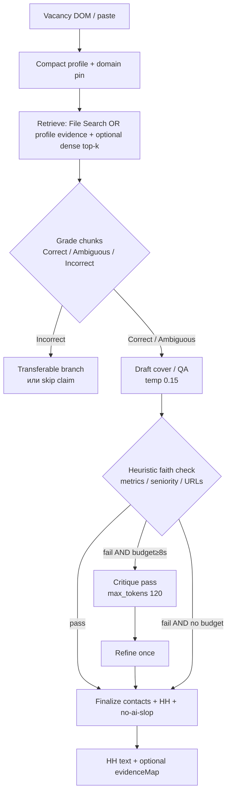
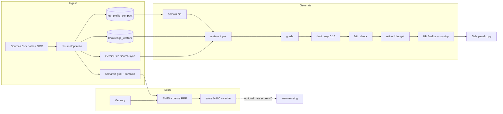

# Autoro Hunt: playbook оптимизации RAG / ATS

Практическая дорожная карта для **Job Responder** (Autoro Hunt): как поднять fidelity откликов, релевантность JD↔профиль и ATS-проходимость **без переписывания архитектуры с нуля**.

Связанные docs: [README](./README.md) · [gemini-rag.md](./gemini-rag.md) · [model-routing.md](./model-routing.md) · [prompts-ultra-short.md](./prompts-ultra-short.md)

**Принцип:** elevate, don't rewrite. Compact profile + semantic grid + domain pin + anti-embellish уже работают - поверх них добавляем grading, hybrid rank, faithfulness loop и eval harness.

---

## 0. Executive summary (для Влада)

| Цель | Что делать на текущем стеке |
|------|----------------------------|
| Лучшие персонализированные отклики | Self-reflection loop поверх generate: retrieve → grade → draft → faith critique → refine (в бюджете CF ~15–35с) |
| Релевантность vs профиль | Semantic grid оставить Tier 0; добавить BM25 + dense (уже `knowledge_vectors`) + RRF; cross-encoder - offline / batch |
| Качество текста | STAR/XYZ + no-ai-slop + anti-cliché + transferable-skills ветка; attribution `source_chunk_id` в debug, не в HH-тексте |
| Не делать сейчас | Полный GraphRAG, fine-tune Self-RAG reflection tokens, отдельный MCP `ragas-eval` / `ats-linter` |

**Top-5 на эту неделю** - см. [§12](#12-top-5-действий-на-эту-неделю).

---

## 1. Что есть сегодня vs gaps

### 1.1 Уже в проде (baseline ~v0.9.9)

| Компонент | Где | Заметка |
|-----------|-----|---------|
| Unified **compact profile** | `job_responder.py` merge + caps ~2800/1600 | Не дампим PDF в prompt |
| **Gemini File Search** (opt-in) | `job_responder_gemini_rag.py`, flag `JOB_RESPONDER_GEMINI_RAG` | Citations есть; не = CRAG grade |
| **Semantic skill grid** | `job_responder_semantic.py` | Exact → synonym cluster → fuzzy; **0 LLM** на hot path |
| **Domain pinning** | `job_responder_optimize.py` `DOMAIN_CATALOG` + `pin_domain_facts` | Отрасль вакансии → pinned bullets в compact |
| **Anti-embellish** + temp **0.15** | `strip_embellished_language_claims`, `JR_GENERATE_TEMPERATURE` | Senior/CEFR/эксперт без опоры → soften |
| **no-ai-slop** + HH ASCII | `hh_format_text`, ultra-short rules 6–7 | `-`, `->`, `"`; scrub клише |
| **Relevance cache** | extension `jrRelevanceCache` | Список → карточка без повторного API |
| **Generate cascade** | openmodel → gemini flash → GLM | Budget ~34с CF |
| **pgvector search** | `_resume_search_rows` + `knowledge_vectors` | Dense есть; **не** в relevance score и не в RRF |
| Permanent KB optimize | `POST .../resume/optimize` | Master `job_profile_compact` + domains |
| Unit tests | `agent-api/tests/test_job_responder_*.py` | Нет golden JD–resume / faithfulness suite |

### 1.2 Gaps (research → Autoro Hunt)

| Research idea | Gap сейчас | Целевой next step |
|---------------|------------|-------------------|
| Self-RAG / CRAG loop | Single-pass generate + post scrub | Легкий grade+critique в том же request budget |
| GraphRAG / ESCO / O*NET | Hand-curated `_CLUSTER_TERMS` + `DOMAIN_CATALOG` | Synonym graph JSON → позже ESCO IDs |
| BM25 + RRF + cross-encoder | Relevance = grid heuristics only | BM25+dense+RRF на `/relevance`; CE offline |
| Faithfulness / ARES / C2-Faith | Heuristic anti-embellish only | Claim↔profile entailment + Ragas offline |
| `source_chunk_id` | Citations только у Gemini path | Internal attribution; UX без сырых id |
| Career-unit chunking | Смешанный ingest (файл / notes / OCR) | Chunk по job/project/education при optimize |
| Eval harness | Smoke + unit | `agent-api/evals/job_responder/` + CI gate |
| MCP ats-linter / ragas-eval | **Не существуют** в workspace | Script + pytest (см. §9) |

---

## 2. Research → phased roadmap

### Phase A - Quick wins (1–2 недели, низкий риск)

1. **Cliché / tone ban-list** в ultra-short + `hh_format_text` (EN+RU): `thrilled to apply`, `passionate about`, `leverage my expertise`, `динамично развивающаяся компания`, `выразить заинтересованность` и т.д. (полный список - §10).
2. **Transferable skills branch** в system prompt: нет прямого match → 1 bullet "смежный опыт" с явным `related:` и без выдуманных метрик.
3. **Career-unit hints** в `resume/optimize`: теги `job:`, `project:`, `education:` в evidence строк grid.
4. **Eval skeleton**: golden pairs + metric stubs (faithfulness placeholder = claim coverage heuristic).
5. **Debug-only attribution**: в API response `evidenceMap: [{claim, sourceIds}]` при `?debug=1` / admin flag; в текст отклика для HH - не светить.

### Phase B - Medium (2–6 недель)

1. **Hybrid relevance**: BM25 (Postgres `tsvector` или `rank_bm25` на skills+content) + dense (`knowledge_vectors` / compact embed) → **RRF**; semantic grid как feature boost, не единственный score.
2. **CRAG-lite retrieve grade**: top-k chunks → Correct / Ambiguous / Incorrect (детерминированно по grid overlap + cosine; LLM-grade только если budget >20с остатка).
3. **Self-reflection refine**: один короткий critique pass (`max_tokens` ≤120, temp 0) только если draft fails heuristic faith check.
4. **Lightweight skill ontology file**: `data/job-responder/skill-synonyms.json` (RU/EN) с optional `esco_id` / `onet_code` nullable.
5. **ATS lint script**: `scripts/job-responder-ats-lint.mjs` - single column, no tables, banned section titles.

### Phase C - Research / later

1. Cross-encoder re-rank (`cross-encoder/ms-marco-MiniLM-L-6-v2`) offline batch для списка вакансий / nightly.
2. Full **GraphRAG**-style community summaries по projects graph (только если synonym graph + hybrid не хватает).
3. ESCO API sync + O*NET crosswalk job.
4. Trained reflection tokens / Self-RAG fine-tune - **не** нужно для CF product path.
5. LLM-as-judge ARES-style paired eval в CI (дорогой) - weekly, не per-PR.

---

## 3. Self-reflection loop для generate (CF budget)

### 3.1 Целевая схема (адаптация Self-RAG + CRAG без обучения модели)



### 3.2 Token / latency budget (Cloudflare ~15–35с wall)

Константы сейчас: `GENERATE_BUDGET_SEC≈34`, provider attempt ~11с, cascade openmodel→gemini→glm.

| Шаг | Бюджет | Реализация |
|-----|--------|------------|
| Merge + domain pin + format compact | ≤0.5с | Уже есть |
| Retrieve (File Search или dense top-8) | ≤3–6с | File Search только если ready; иначе skip |
| Grade chunks | ≤50–100мс | **Без LLM**: overlap score vs JD skills |
| Draft generate | 8–18с | Существующий cascade |
| Heuristic faith | ≤20мс | Расширить anti-embellish |
| Critique + refine | **только если** `remaining ≥ 8с` и fail | 1 вызов flash, temp 0 |
| Finalize | ≤50мс | contacts / links / hh_format |

**Правила экономии:**

- Critique **никогда** не запускать на первом provider timeout path.
- При `profile_compressed` / mini-retry - critique skip.
- QA mode: critique только claims с цифрами / tool names.
- Не делать 2 refine - один максимум (Self-RAG "reflection" как prompt, не как fine-tune).

### 3.3 Grade labels (CRAG-lite)

| Label | Условие | Действие |
|-------|---------|----------|
| Correct | skill/domain evidence ≥ threshold | Можно цитировать метрики из chunk |
| Ambiguous | только synonym / transferable | Формулировка "смежный опыт…", без чужих KPI |
| Incorrect | нет покрытия | Не генерировать bullet под требование |

---

## 4. Skill ontology: ESCO / O*NET (легковесный путь)

### 4.1 Сейчас

- `_CLUSTER_TERMS` в `job_responder_semantic.py` (маркетинг, ROAS, PPC, …).
- `DOMAIN_CATALOG` в `job_responder_optimize.py` (tourism, ecommerce, SaaS, EdTech, fintech, …).

Это уже **синонимический граф вручную** - правильный MVP.

### 4.2 Lightweight synonym graph (Phase B)

Файл (пример структуры):

```json
{
  "version": 1,
  "nodes": [
    {
      "id": "skill.performance_marketing",
      "labels": ["performance marketing", "перфоманс", "performance-маркетинг"],
      "esco_id": null,
      "onet_element": null,
      "parents": ["skill.marketing"],
      "children": ["skill.google_ads", "skill.meta_ads"]
    }
  ]
}
```

- Load once at process start; merge с `_CLUSTER_TERMS` (code wins on conflict until file proven).
- `esco_id` / O*NET заполнять **опционально** скриптом импорта, не блокировать generate.

### 4.3 Full GraphRAG later

- Entities: Role, Skill, Tool, Project, Domain, Metric.
- Edges: `USED_IN`, `TRANSFERS_TO`, `REQUIRES`, `EVIDENCED_BY(chunk_id)`.
- Community summaries только для workspace с >N projects.
- **Не** тащить Microsoft GraphRAG stack целиком - слишком тяжело для CF request path.

### 4.4 Ссылки онтологий

- ESCO: https://esco.ec.europa.eu/en/classification/skill_main
- ESCO API: https://esco.ec.europa.eu/en/use-esco/use-esco-services-api
- O*NET: https://www.onetcenter.org/database.html
- Crosswalk ideas: map ESCO skill ↔ O*NET detailed work activities offline.

---

## 5. Hybrid relevance: BM25 + dense + RRF (+ CE)

### 5.1 Upgrade path от semantic grid

```
score_v1 = weighted(skills_grid, tools, role, format, exp, domain_pin)
score_v2 = RRF(BM25_rank, dense_rank) * 100  +  grid_boost  +  domain_boost
```

Рекомендуемые веса старта:

| Сигнал | Вес / роль |
|--------|------------|
| RRF(BM25, dense) | база 0–70 |
| Semantic grid coverage | +0–20 |
| Domain pin match | +0–10 |
| Format / remote fit | +0–5 (как сейчас) |
| Cross-encoder | **не** в `/relevance` hot path; batch "Оценить список" nightly или opt-in |

### 5.2 Что уже есть для dense

- Ingest пишет `knowledge_vectors.embedding`.
- `_resume_search_rows` умеет `embedding <-> query`.
- **Сделать:** эмбеддить JD (title+skills+desc≤1k) один раз на `/relevance`; RRF с BM25 по `content_text` / skills list.

### 5.3 BM25 варианты (по приоритету простоты)

1. Postgres `to_tsvector('simple', …)` + `ts_rank_cd` - уже в том же DB, без новых сервисов.
2. Или in-memory BM25 по compact skills string для batch ≤50 вакансий.

### 5.4 Cross-encoder

- Модель: `cross-encoder/ms-marco-MiniLM-L-6-v2` (или multilingual аналог для RU).
- Bi-encoder refs: `BAAI/bge-large-en-v1.5`, `sentence-transformers/all-MiniLM-L6-v2` - **не обязательно менять** текущий Swoop embedding pool; RRF терпим к разным spaces если ranks, не raw cosine, фьюзятся.
- Запуск: worker / cron, кэш в `jrRelevanceCache` shape.

### 5.5 UX

- Side panel по-прежнему показывает 0–100 + matched / missing / semanticMatches.
- Добавить `scoreBreakdown: { rrf, grid, domain }` в API (collapsed в UI).

---

## 6. Faithfulness guardrails + source attribution

### 6.1 Без ломки UX

| Слой | Поведение |
|------|-----------|
| Текст для HH | Чистый отклик: факты, без `[chunk:12]`, без JSON |
| API / debug | `evidenceMap`, `ungroundedClaims[]`, `faithScore` |
| Generator internal | Можно просить JSON intermediate, затем render to markdown |

### 6.2 Схема intermediate (опционально Phase B)

```json
{
  "bullets": [
    {
      "text": "Рост ROAS x2 на Meta Ads в tourism funnel",
      "source_chunk_ids": ["ki_1842"],
      "transferable": false
    }
  ],
  "omitted_requirements": ["Airflow"]
}
```

Render → текущий `# ОТКЛИК НА ВАКАНСИЮ` без id.

### 6.3 Guardrails (расширение anti-embellish)

1. Числа / % / $ / xN - должны встречаться в compact / retrieved text (нормализованно).
2. Tool names - из profile tools/skills/grid.
3. Seniority / CEFR / "эксперт" - уже scrub.
4. URL - только из contacts/links collect.
5. **Transferable** bullets: запрет копировать чужие KPI из JD.

### 6.4 Personalization & anti-cliché (дополнение к truncated mission)

Избегай (и стрипай post-process):

**EN:** `thrilled to apply`, `I am writing to express`, `passionate about`, `leverage my expertise`, `synergy`, `cutting-edge`, `excited about the opportunity`, `perfect fit`, `dynamic team`, `hit the ground running`.

**RU:** `выразить заинтересованность`, `динамично развивающаяся`, `в современном мире`, `открыт к новым вызовам`, `идеально подхожу`, `буду рад стать частью команды` (если без факта), `высокий уровень экспертизы` без источника.

**Вместо этого:** 1 заголовок (роль/компания/формат) → 3–4 факта из RAG под JD → 1 transferable (если нужно) → CTA → контакты/ссылки.

Каждый bullet: либо **прямой** факт с метрикой из profile, либо **смежный** опыт с честной формулировкой (`смежный опыт: …`), либо **пропуск** требования.

---

## 7. Eval harness

### 7.1 Цели метрик

| Метрика | Смысл | Автоматизация |
|---------|-------|---------------|
| Context precision | Доля retrieved chunks, нужных для JD | Overlap vs labeled must-have skills |
| Faithfulness | Claims ⊆ profile evidence | Heuristic + optional LLM judge |
| Answer relevance | Письмо отвечает на JD, не generic | Embedding cosine letter↔JD + keyword hit |
| Actionability | STAR/XYZ shape | Regex / rubric checklist |
| ATS lint | Plain-text friendly | Script |

### 7.2 Golden set

Путь (skeleton): `agent-api/evals/job_responder/`

```
golden/
  cases/
    tourism-meta-ads.json
    saas-no-direct-match.json
  README.md
metrics/
  faithfulness_heuristic.py
  run_eval.py
```

Формат case:

```json
{
  "id": "tourism-meta-ads",
  "vacancy": { "title": "...", "description": "...", "structured": { "keySkills": [] } },
  "profile_fixture": "fixtures/compact_tourism.json",
  "must_include_facts": ["ROAS", "Meta"],
  "must_not_claim": ["Airflow", "C1 English", "senior"],
  "allow_transferable": true
}
```

### 7.3 Regression gate

- `pytest agent-api/evals/job_responder` или `python -m evals.job_responder.run_eval`.
- Перед merge в JR: все golden `must_not_claim` = 0 hits; faithfulness ≥ порога.
- Ragas (`ragas` pip): offline weekly - Faithfulness / ContextPrecision adapters; **не** обязателен MCP.

### 7.4 ARES / C2-Faith

- ARES: LLM-as-judge с калибровкой на tiny human labels - использовать когда golden ≥30 cases.
- C2-Faith style: claim decomposition → entailment vs evidence - совпадает с heuristic + critique pass.

---

## 8. Рекомендуемый end-to-end pipeline (mermaid)



---

## 9. MCP / tools inventory

### 9.1 Есть в этом workspace / окружении

| Инструмент | Статус | Как использовать для Hunt |
|------------|--------|---------------------------|
| **Postgres + pgvector** | В agent-api / Swoop DB; embeddings уже пишутся | Основной store; RRF SQL; schema audit |
| MCP `postgres` (`@modelcontextprotocol/server-postgres`) | В `MCP_CONFIG_WITH_ALL_SERVERS.json` | Инспекция schema / ad-hoc SQL (осторожно с secrets в URI) |
| MCP `user-DBHub` | В Cursor namespaces; сейчас может быть error | Альтернатива postgres MCP для запросов |
| MCP `user-obsidian-vault` | Ready | Заметки по playbook / HH правилам |
| MCP `user-Tavily` / Tavily | Configured | Research JD market / company facts (**не** выдумывать в письмо без профиля) |
| MCP filesystem / puppeteer | Config | Локальные файлы / редкий scrape |
| Swoop Admin keys | Gemini / openmodel / GLM / embeddings | Generate + File Search + embed |
| Skill `no-ai-slop` | `.cursor/skills` / autorotech-tech | Промпт + scrub |
| Unit tests JR | `agent-api/tests/` | Не заменяют golden eval |

### 9.2 Имена из research mission - чего нет

| Запрошенный MCP | Реальность | Альтернатива |
|-----------------|------------|--------------|
| `postgres-mcp` / pgvector MCP | Частично: `postgres` MCP + код pgvector | Оставить; чинить DBHub при необходимости |
| `ats-linter-mcp` | **Не существует** | `scripts/job-responder-ats-lint.mjs` (regex/plain-text) |
| `ragas-eval-mcp` | **Не существует** | `pip install ragas` + pytest / `run_eval.py` |

### 9.3 Что поставить (по желанию)

```bash
# offline eval (dev machine / CI)
pip install ragas sentence-transformers rank-bm25
# optional CE experiments
# pip install sentence-transformers  # includes cross-encoder helpers
```

Не добавлять тяжёлые MCP ради одного eval - скрипт проще и стабильнее в CI.

---

## 10. Prompt / quality tips (практика)

### 10.1 Структуры ответов

| Метод | Когда | Шаблон |
|-------|-------|--------|
| **XYZ** (Google) | Cover bullets | `Achieved X as measured by Y by doing Z` - только если X,Y,Z есть в RAG |
| **STAR** | QA / behavioral Forms | Situation → Task → Action → Result; Result без фантазии |
| **Transferable** | Нет прямого skill | `Смежный опыт: [факт]. Переносимо на [требование JD] через [общий механизм].` |

### 10.2 Правила генерации (синхрон с ultra-short)

1. Нет факта → пропуск пункта (не вода).
2. Отрасль из JD + `domains_matched` → обязательный 1 bullet.
3. 3–4 факта max; коротко.
4. Temp 0.15; critique temp 0.
5. HH formatting + no-ai-slop всегда post-process.
6. Контакты/ссылки только authoritative finalize.

### 10.3 QA Forms

- Копировать текст вопроса буквально.
- Числовые ответы - только из profile.
- "Есть ли опыт X?" при Ambiguous → честное "прямого нет; смежный: …".

### 10.4 Индустриальный pinning

Уже есть pipeline - усиливать данные, не промпт:

- После новых sources жать **Оптимизировать базу**.
- В правках RAG явно писать домены: `domains: tourism, ecommerce`.
- Проверять status `optimized` / domains в panel.

---

## 11. Chunking audit (career units)

**Требование research:** chunks = job / project / education, не тупой token split.

**Практика Autoro Hunt:**

1. При `resume/optimize` парсить experience blocks → отдельные evidence strings с prefix `job:`, `project:`.
2. File Search sync: один doc на source OK; внутри doc - заголовки секций.
3. Не резать посередине метрики и названия инструментов.
4. Overrides / contacts - отдельный kind (уже так).

TODO в коде (ориентиры):

- `job_responder_optimize.py` - emit `evidence_units[]` с `unit_type`.
- `job_responder_semantic.py` - prefer unit boundaries when building grid evidence.

---

## 12. Top-5 действий на эту неделю

1. **Расширить ban-list клише** (EN+RU) в `hh_format_text` + ultra-short rule 7; вручную прогнать 5 реальных откликов.
2. **Добавить transferable-skills rule** в system prompt + 1 golden case `saas-no-direct-match`.
3. **Скелет eval:** `agent-api/evals/job_responder/` с 3–5 golden JSON + heuristic `must_not_claim`.
4. **Замерить:** на 10 вакансиях сравнить score grid-only vs prototype RRF (скрипт, без UI) - решить веса.
5. **Документировать evidenceMap** как debug field (не реализовывать GraphRAG / CE в hot path).

---

## 13. Learning references

### Papers / frameworks

| Тема | Ссылка |
|------|--------|
| Self-RAG | https://arxiv.org/abs/2310.11511 · https://github.com/AkariAsai/self-rag · ICLR 2024 PDF |
| CRAG | https://arxiv.org/abs/2401.15884 |
| GraphRAG (Microsoft) | https://arxiv.org/abs/2404.16130 · https://github.com/microsoft/graphrag |
| RAG survey / original RAG | Lewis et al. https://arxiv.org/abs/2005.11401 |
| Ragas | https://docs.ragas.io/ · https://github.com/explodinggradients/ragas |
| ARES | https://arxiv.org/abs/2311.09476 |
| BGE embeddings | https://huggingface.co/BAAI/bge-large-en-v1.5 |
| MiniLM bi-encoder | https://huggingface.co/sentence-transformers/all-MiniLM-L6-v2 |
| ms-marco cross-encoder | https://huggingface.co/cross-encoder/ms-marco-MiniLM-L-6-v2 |
| RRF | Cormack et al. "Reciprocal Rank Fusion" (SIGIR 2009) |

### Ontologies / ATS practice

| Тема | Ссылка |
|------|--------|
| ESCO skills | https://esco.ec.europa.eu/ |
| O*NET database | https://www.onetcenter.org/database.html |
| XYZ (Google re:Work style) | поиск: "Google XYZ formula resume" |
| STAR | стандарт behavioral interview |
| no-ai-slop | https://github.com/autorotech-tech/no-ai-slop |

### Внутренние

- Этот playbook: `docs/job-responder/rag-ats-optimization-playbook.md`
- Runtime prompts: `docs/job-responder/prompts-ultra-short.md`
- Token routing: `docs/job-responder/model-routing.md`
- Gemini RAG: `docs/job-responder/gemini-rag.md`

---

## 14. Non-goals (чтобы не расползтись)

- Не переписывать extension MV3 и не менять HH DOM extract в рамках RAG research.
- Не подключать OpenRouter как primary.
- Не fine-tune Self-RAG reflection tokens.
- Не показывать `source_chunk_id` в copy-paste для HH.
- Не ставить GraphRAG / Neo4j пока synonym graph + RRF не исчерпаны.
- Не блокировать generate на недоступности File Search - compact остаётся default.

---

## 15. Changelog

| Дата | Что |
|------|-----|
| 2026-08-27 | TOOL PIN: JD tools ∩ Resume KB (keySkills + description) inject into CRAG hints; rule #10; faith `missing_tool:*`; Cursor/Antigravity known tools |
| 2026-08-26 | Phase 1 start: CRAG-lite in generate (grade hints, faith check, critique+refine when budget≥8s) |
| 2026-08-26 | Phase 0 baseline: 7 golden cases, `job_responder_format.py`, CI gate in `keept-staging-smoke.yml`, transferable rule #9 |
| 2026-08-26 | Первый playbook: audit baseline v0.9.x → phased CRAG-lite / hybrid / eval / MCP inventory |
