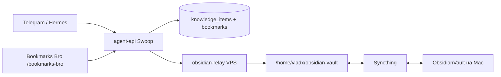

# Локально: Obsidian vault + просмотр БЗ и закладок

Vault на Mac: **`/Users/vlad_x/Desktop/soft/ObsidianVault`**

## Схема (параллельно с БЗ)



1. **БЗ (источник правды для поиска)** — Postgres через `agent-api`: `knowledge_items`, embeddings, закладки Bookmarks Bro.
2. **Ссылки из поста (главное)** — при `extract-and-capture` / `capture` LLM возвращает `links: [{label, url}]`; каждая ссылка уходит в **Bookmarks Bro**, в Obsidian — блок **«Ссылки из поста»** + `reference_urls` в frontmatter.
3. **Obsidian .md на VPS** — при каждом capture relay пишет файл в `Autoro KB/ws-1/...`.
4. **Mac** — та же папка через **Syncthing** (или **local relay** + Tailscale, опционально).

---

## 1. Obsidian на Mac

### Один раз

```bash
cd /Users/vlad_x/Desktop/n8n/autoro.tech/website
bash scripts/bootstrap-obsidian-vault.sh "/Users/vlad_x/Desktop/soft/ObsidianVault"
```

В Obsidian: **Open folder as vault** → выберите  
`/Users/vlad_x/Desktop/soft/ObsidianVault`  
(не «Obsidian Sync» из облака Obsidian).

### Syncthing с VPS

На VPS (из корня `website` на сервере):

```bash
export OBSIDIAN_VAULT_MOUNT=/home/vladx/obsidian-vault
docker compose -f docker-compose.syncthing.yml up -d
```

GUI: `http://46.250.228.229:8384` — связать Mac, shared folder **ObsidianVault**:

| Сторона | Путь |
|--------|------|
| VPS | `/home/vladx/obsidian-vault` (в контейнере `/var/syncthing/ObsidianVault`) |
| Mac | `/Users/vlad_x/Desktop/soft/ObsidianVault` |

Режим: **Send & Receive**. После сохранения в БЗ из Telegram — статус **Up to date**, файл в  
`Autoro KB/ws-1/Knowledge Inbox/`.

### Опционально: запись сразу на Mac (без ожидания Syncthing)

```bash
cp scripts/obsidian-local-relay.env.example scripts/obsidian-local-relay.env
# в .env уже указан ваш vault
bash scripts/obsidian-local-relay.sh   # порт 8788
```

На VPS в env `agent-api` (Tailscale IP Mac):

```env
OBSIDIAN_SYNC_WEBHOOK_URL_SECONDARY=http://100.x.x.x:8788/sync
```

Тогда при capture пишется и на сервер, и локально.

---

## 2. Удобный UI: БЗ + закладки (Bookmarks Bro)

В проекте уже есть веб-приложение **`/bookmarks-bro`**:

| Вкладка | Что смотреть |
|--------|-------------|
| Search | Семантический поиск по закладкам Bookmarks Bro |
| Knowledge | Карточки БЗ, экспорт MD/ZIP в Obsidian |
| Notes / Ideas / Reminders | Локальные заметки UI (синк с сервером) |

### Локальный запуск (Mac)

```bash
cd /Users/vlad_x/Desktop/n8n/autoro.tech/website
cp .env.example .env   # если ещё нет
```

В `.env` добавьте (ключ из Swoop → Settings → agent-api):

```env
VITE_BOOKMARKS_API_KEY=<ваш ключ agent-api>
# API на проде (swoop):
VITE_AGENT_API_PROXY_TARGET=https://swoop.autoro.tech
```

```bash
npm install
npm run dev
```

Откройте: **http://localhost:5173/bookmarks-bro**

- Поиск закладок — вкладка **Search**
- База знаний — **Knowledge** (подтягивается с API + можно экспорт в vault)
- Админка воркеров закладок: **http://localhost:5173/admin/bookmarks-bro**

### Расширение Chrome

`extensions/bookmarks-bro/` → popup → **Knowledge App** открывает тот же `/bookmarks-bro`.

---

## 3. Пути заметок

| Что | Путь |
|-----|------|
| Mac (Obsidian) | `/Users/vlad_x/Desktop/soft/ObsidianVault/Autoro KB/ws-1/Knowledge Inbox/<slug>.md` |
| VPS | `/home/vladx/obsidian-vault/Autoro KB/ws-1/Knowledge Inbox/<slug>.md` |

Если в боте **Obsidian: нет**, а ID в БЗ есть — файл на диск ещё не записан (relay); данные всё равно в Swoop. Частая причина на VPS: `autoro-agent-api` и `autoro-obsidian-relay` в **разных Docker-сетях** → `docker network connect autoro-dashboard_default autoro-agent-api`. Затем `POST /api/v1/knowledge/{id}/re-enrich` или повторный capture. Файл уедет на Mac через Syncthing.

---

## 4. Проверка

```bash
# Mac: структура vault
ls "/Users/vlad_x/Desktop/soft/ObsidianVault/Autoro KB/ws-1/Knowledge Inbox"

# API + UI
npm run bookmarks-bro:api-test

# VPS: файл после capture
ssh vladx@46.250.228.229 'ls "/home/vladx/obsidian-vault/Autoro KB/ws-1/Knowledge Inbox/"'
```

См. также: [obsidian-syncthing-setup.md](../scripts/obsidian-syncthing-setup.md)
